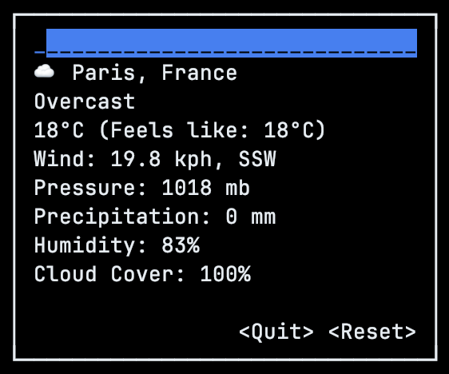
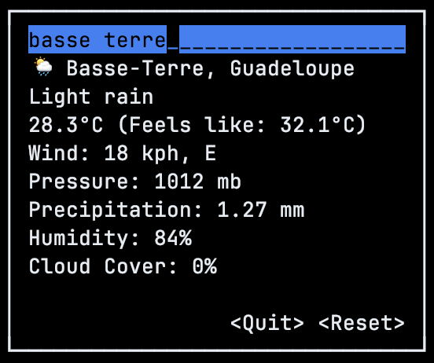

# weathe-rs

## About

### Purpose

This is a pretty straightforward Rust project that displays current weather information about the city you enter.

### Demo

By default, you will see the weather for the city your IP address is located in. Here is how it looks:



But you can also search for the city you want with the search bar at the top:



The `<Reset>` button resets to your default location.

The `<Quit>` button quits the app.

## Installation

Clone this project with 

`git clone https://github.com/malcolm-a/weathe-rs.git`

You will need to obtain a free [weatherapi](https://www.weatherapi.com) API in order to run this project with your own API key.
Put this key in `src/api_key.rs` :

```rust
pub const API_KEY: &str = "YOUR_API_KEY";
```

Finally, run `cargo run` at the root of the project directory to run the project.